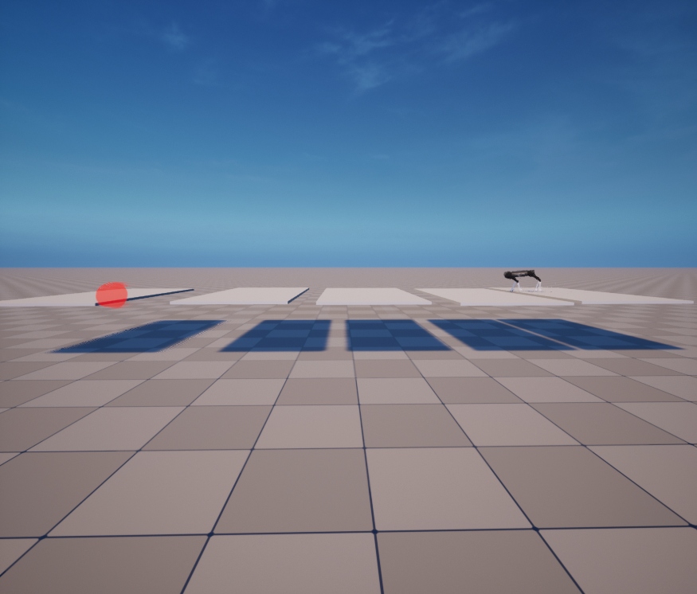
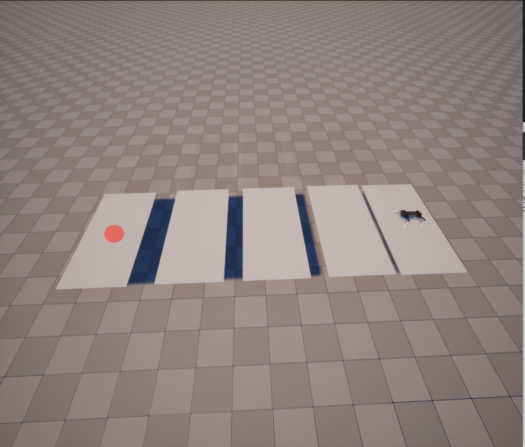

PROJECT RULE
======

Project Overview
-----

Project Objectvie
-----
This project's goal is to **cross the stepping stone (e.g. There are gaps between the ground) and
reach the goal** 
which is represented as a red sphere. 
You can refer RaiSim document website: [raisim_website](http://raisim.com/index.html). 
For your convenience, a basic template for the project is provided as a git repository. [git_repo](https://github.com/jhwangbo/ME491_2022_project). 
For evaluation, you need to **submit the video file** to represent your result.

Project Rule
-----
1. There is no limitation on observation (You can use any information given RaiSim engine)
2. There is no limitation on using other sources
3. ### If you have any question, Please upload Issues on [git_repo](https://github.com/jhwangbo/ME491_2022_project). (We do not allow others)
4. For validating, **discrete environment condition** will be given 3 days before the submit date. (Exact gap, height will be provided)

Environment Condition
-----
1. There are total 5 flat surfaces (3m x 6m x 0.1m)
2. The horizontal gaps (x-directional) between the grounds are 20cm, 40cm, 60cm, 80cm each. In addition, there is random noise follows (5cm * N(0, 1)) that adds to the gap distance. 
3. The vertical distance (z-directional) of the surfaces : **1.0 + 0.01*N(0,1) m**  
4. The **last flat surface moves bi-directionally (x-directional) at a speed of 40cm/sec**. The direction might be changed 
every 1 second.
5. The goal position (red sphere) is identical with last one's center.

Submission
------
| Submission       | Date | Format           |
|------------------|------|------------------|
| Report Deadline  | ?    | pdf              |
| Project Deadline | ?    | mp4 (Video Only) |

Project Result
-----
Please submit a mp4 file named **'(student number)_(name).mp4'**  Among several videos, We'll choose one that gives the best result.

#### **The project will be conducted instead of the final exam, and the project results will be announced on the day of the final exam.**

Report
-----
Final report should contain these contents:
1. ~~
2. ~~
3. ~~ (T.B.D)

Visualization
-----
Launch 